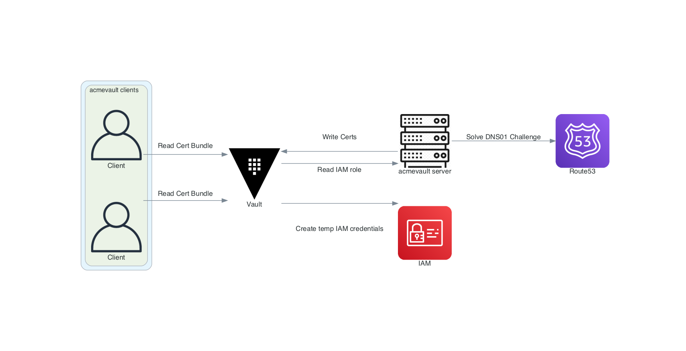

[](https://goreportcard.com/report/github.com/soerenschneider/acmevault)

# acmevault

## Problem Statement

Rolling out TLS encryption shouldn't need to be pitched anymore (even for internal services). Using the DNS01 ACME challenge is proven and allows issuing certs non-public routable machines. On the other hand, you need to have access to either highly-privileged/narrowly-scoped credentials of your DNS provider to solve these DNS01 challenges.

In the case of Route53, if you don't want to end up creating dozens of hosted zones, one for each of your subdomains, you're at risk of leaking highly-privileged IAM credentials.

Acmevault requests short-lived IAM credentials for Route53 and uses them to perform DNS01 challenges for the configured domains and writes the issued X509 certificates to Hashicorp Vault's K/V secret store - only readable by the appropriate AppRole.

Its client mode reads the respective written certificates from Vault and installs them to a preconfigured location, optionally invoking post-installation hooks.


## Overview


## Installation
### Compile
Clone the repository by running `git clone https://github.com/soerenschneider/acmevault.git` and just run a `make build` inside the repository in order to build the client and the server locally.

### Pre-compiled Binaries

Pre-compiled binaries can be found at the releases section. They are signed using a cryptographic signature made by [signify](https://man.openbsd.org/signify.1) using the following public key: 
```
untrusted comment: signify public key
RWSFxNuvQMx07H1IC6sUxJvlsdtfDlY39EdoHMG/ZpivtOmp8sJ3DMEg
```

In order to verify, run
```bash
$ signify -V -p /path/to/downloaded/pukey -m checksum.sha256
$ sha256sum -c checksum.sha256
```

## Server component
### Configuration example
```json
{
  "vaultAddr": "https://vault:8200",
  "vaultRoleId": "my_role_id",
  "vaultSecretId": "my_secret_id",
  "metricsPath": "/var/lib/node_exporter/acmevault_server.prom",
  "email": "my-acme-email@domain.tld"
}
```
### Configuration reference
| Keyword     | Description                                                                                           | Example                               | Mandatory |
|-------------|-------------------------------------------------------------------------------------------------------|---------------------------------------|-----------|
| vaultAddr        | Connection string for vault                                                                      | https://vault:8200                    | Y         |
| vaultRoleId      | [AppRole role id](https://www.vaultproject.io/docs/auth/approle) to login                        | 988a9dfd-ea69-4a53-6cb6-9d6b86474bba  | Y         |
| vaultSecretId    | [AppRole secret id](https://www.vaultproject.io/docs/auth/approle) to authenticate against vault | 37b74931-c4cd-d49a-9246-ccc62d682a25  | Y         |
| vaultPathPrefix  | Path prefix for the K/V path in vault for this instance running acmevault                        | production                            | N         |
| email            | Email to register at ACME server                                                                 | your@email.tld                        | Y         |
| metricsPath      | Path to write metrics to on filesystem                                                           | /var/lib/node_exporter/acmevault.prom | N         |
| acmeUrl          | URL of the acme provider                                                                         | /var/lib/node_exporter/acmevault.prom | N         |

## Client component
### Configuration
```json
{
  "vaultAddr": "https://vault:8200",
  "metricsPath": "/var/lib/node_exporter/acmevault_client.prom",
  "user": "root",
  "group": "root",
  "certFile": "/etc/nginx/my_cert.crt",
  "privateKeyFile": "/etc/nginx/my_private_key.key",
  "vaultRoleId": "my_role_id",
  "vaultSecretId": "my_secret_id",
  "vaultPathPrefix": "production",
  "hooks": [
    "echo",
    "it works"
  ]
}
```

### Configuration reference

| Keyword          | Description                                                                                      | Example                               | Mandatory |
|------------------|--------------------------------------------------------------------------------------------------|---------------------------------------|-----------|
| vaultAddr        | Connection string for vault                                                                      | https://vault:8200                    | Y         |
| vaultRoleId      | [AppRole role id](https://www.vaultproject.io/docs/auth/approle) to authenticate against vault   | 988a9dfd-ea69-4a53-6cb6-9d6b86474bba  | Y         |
| vaultSecretId    | [AppRole secret id](https://www.vaultproject.io/docs/auth/approle) to authenticate against vault | 37b74931-c4cd-d49a-9246-ccc62d682a25  | Y         |
| vaultPathPrefix  | Path prefix for the K/V path in vault for this instance running acmevault                        | production                            | Y         |
| user             | User that will own the written certificate and key on disk                                       | root                                  | Y         |
| group            | Group that will own the written certificate and key on disk                                      | root                                  | Y         |
| certFile         | The file path to write the certificate to                                                        | /etc/ssl/ssl-bundle.crt               | N*        |
| privateKeyFile   | The file path to write the private key to                                                        | /etc/ssl/ssl-bundle.key               | N*        |
| pemFile          | The file path to write the data in the PEM format to                                             | /etc/haproxy/my-domain.pem            | N*        |
| hooks            | Commands to run after new cert files have been written                                           | ["echo", "it worked"]                 | N         |
| metricsPath      | Path on the disk to write metrics to                                                             | /var/lib/node_exporter/acmevault.prom | N         |

&ast; You have to either provide pemFile _or_ a certFile / privateKeyFile tuple

## Vault Resources

A Terraform module that sets up Vault in order to use acmevault can be found [in this repository](https://github.com/soerenschneider/tf-vault).  

## Metrics

| Subsystem | Metric                                     | Type    | Description                                                           | Labels            |
|-----------|--------------------------------------------|---------|-----------------------------------------------------------------------|-------------------|
| server    | vault_aws_credentials_requested_total      | counter | Total amount of dynamic AWS credentials requested                     |                   |
| server    | vault_aws_credentials_request_errors_total | counter | Total amount of dynamic AWS credentials requested                     |                   |
| server    | latest_iteration_time_seconds              | gauge   | Latest invocation of the server                                       |                   |
| server    | certificates_retrieved_total               | counter | Total amount of certificates retrieved from ACME provider             |                   |
| server    | certificate_retrieve_errors_total          | counter | Total errors while trying to retrieve certificates from ACME provider |                   |
| server    | certificates_renewals_total                | counter | Total number of renewed certificates                                  |                   |
| server    | certificates_renewal_errors_total          | counter | Total errors while trying to renew certificates                       |                   |
|           | certificates_written_total                 | counter | Total number of certificates written total                            | subsystem         |
|           | certificates_write_errors_total            | counter | Total number of errors while writing the certificate                  | subsystem         |
|           | certificate_errors_total                   | counter | Total number of errors while handling certificates                    | desc              |
|           | certificate_expiry_time                    | gauge   | Timestamp of certificate expiry                                       |                   |
| client    | hooks_invocation_errors                    | counter | Errors while invoking the hooks                                       |                   |
|           | timestamp                                  | gauge   | Date of last measure                                                  |                   |

